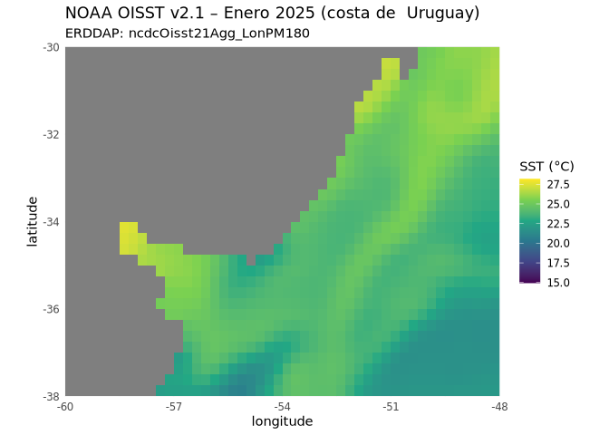
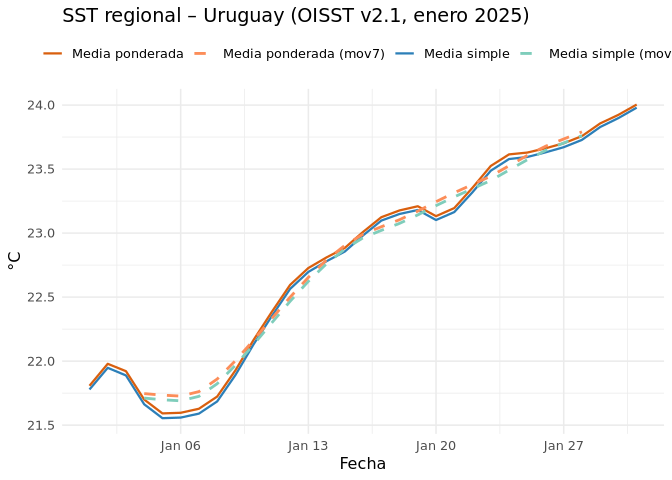
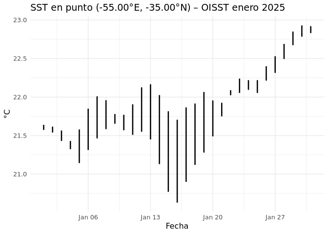
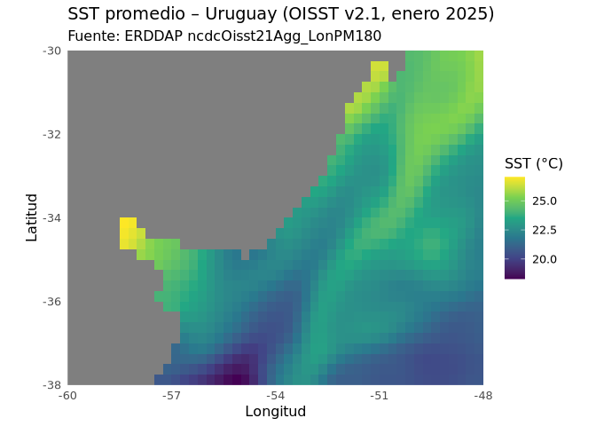

# Datos temporales en R
Sabrina Rodríguez


1.  Objetivo

Describir la variabilidad espacial y temporal de la temperatura
superficial del mar (SST) frente a Uruguay usando NOAA OISST v2.1 a
través de ERDDAP para el período r params\$t0 a r params\$t1 y la región
\[r params\$lon_min, r params\$lon_max\]° lon × \[r params\$lat_min, r
params\$lat_max\]° lat.

Que se hizo en cada comando de scrip: Cálculos:

Mapa promedio mensual del recorte.

Serie regional diaria: media simple y media ponderada por área (peso =
cos(lat)).

Serie puntual: píxel más cercano a (r params\$pt_lon, r params\$pt_lat).

Suavizado con promedio de 7 días (solo para la visualización).

------------------------------------------------------------------------

``` r
library(rerddap)
library(ggplot2)

base <- "https://coastwatch.pfeg.noaa.gov/erddap/"
dsid <- "ncdcOisst21Agg_LonPM180"

lon <- c(-60, -48)
lat <- c(-38, -30)
t0 <- "2025-01-01"
t1 <- "2025-01-31"

g <- griddap(dsid, url = base,
             time = c(t0, t1),
             latitude = lat, longitude = lon,
             fields = "sst")  # en OISST la variable se llama sst (°C)

df <- g$data

ggplot(df, aes(longitude, latitude, fill = sst)) +
  geom_raster() +
  coord_quickmap(xlim = lon, ylim = lat, expand = FALSE) +
  scale_fill_viridis_c(name = "SST (°C)") +
  labs(title = "NOAA OISST v2.1 – Enero 2025 (costa de  Uruguay)",
       subtitle = paste0("ERDDAP: ", dsid)) +
  theme_minimal()
```



``` r
# paquetería para manejo/fechas/suavizado
library(dplyr)
```


    Attaching package: 'dplyr'

    The following objects are masked from 'package:stats':

        filter, lag

    The following objects are masked from 'package:base':

        intersect, setdiff, setequal, union

``` r
library(lubridate)
```


    Attaching package: 'lubridate'

    The following objects are masked from 'package:base':

        date, intersect, setdiff, union

``` r
library(zoo)
```


    Attaching package: 'zoo'

    The following objects are masked from 'package:base':

        as.Date, as.Date.numeric

``` r
dir.create("figuras", showWarnings = FALSE)

# Asegurar columna de fecha (Date)
df <- df %>% mutate(date = as.Date(time))
```

``` r
ts_reg <- df %>%
  group_by(date) %>%
  summarise(
    media_simple = mean(sst, na.rm = TRUE),
    media_pond   = weighted.mean(sst, w = cos(pi/180*latitude), na.rm = TRUE),
    .groups = "drop"
  )
```

``` r
# suavizado (opcional) con ventana de 7 días
ts_reg <- ts_reg %>%
  mutate(media_simple_mov7 = zoo::rollmean(media_simple, 7, fill = NA, align = "center"),
         media_pond_mov7   = zoo::rollmean(media_pond,   7, fill = NA, align = "center"))

p_ts <- ggplot(ts_reg, aes(date)) +
  geom_line(aes(y = media_simple, colour = "Media simple"), linewidth = 0.8) +
  geom_line(aes(y = media_pond,   colour = "Media ponderada"), linewidth = 0.8) +
  geom_line(aes(y = media_simple_mov7, colour = "Media simple (mov7)"), linewidth = 1, linetype = 2) +
  geom_line(aes(y = media_pond_mov7,   colour = "Media ponderada (mov7)"), linewidth = 1, linetype = 2) +
  scale_color_manual(NULL,
    values = c("Media simple" = "#2c7fb8",
               "Media ponderada" = "#d95f0e",
               "Media simple (mov7)" = "#7fcdbb",
               "Media ponderada (mov7)" = "#fc8d59")) +
  labs(title = "SST regional – Uruguay (OISST v2.1, enero 2025)",
       x = "Fecha", y = "°C") +
  theme_minimal(base_size = 12) +
  theme(legend.position = "top")

p_ts
```

    Warning: Removed 6 rows containing missing values or values outside the scale range
    (`geom_line()`).
    Removed 6 rows containing missing values or values outside the scale range
    (`geom_line()`).



``` r
ggsave("figuras/oisst_serie_regional_enero_2025.png", p_ts, width = 8, height = 4.5, dpi = 150)
```

    Warning: Removed 6 rows containing missing values or values outside the scale range
    (`geom_line()`).
    Removed 6 rows containing missing values or values outside the scale range
    (`geom_line()`).

``` r
# exportar tabla para el informe
write.csv(ts_reg, "oisst_serie_regional_enero_2025.csv", row.names = FALSE)
```

``` r
# Cambiá el punto si querés
lon0 <- -55
lat0 <- -35

ts_pt <- df %>%
  group_by(date) %>%
  # píxel más cercano por día
  slice_min((longitude - lon0)^2 + (latitude - lat0)^2, n = 1) %>%
  ungroup() %>%
  transmute(date, sst)

ts_pt <- ts_pt %>%
  mutate(sst_mov7 = zoo::rollmean(sst, 7, fill = NA, align = "center"))

p_pt <- ggplot(ts_pt, aes(date)) +
  geom_line(aes(y = sst), linewidth = 0.9) +
  geom_line(aes(y = sst_mov7), linewidth = 1, linetype = 2) +
  labs(title = sprintf("SST en punto (%.2f°E, %.2f°N) – OISST enero 2025", lon0, lat0),
       x = "Fecha", y = "°C") +
  theme_minimal(base_size = 12)

p_pt
```

    Warning: Removed 1 row containing missing values or values outside the scale range
    (`geom_line()`).

    Warning: Removed 124 rows containing missing values or values outside the scale range
    (`geom_line()`).



``` r
ggsave("figuras/oisst_serie_punto_enero_2025.png", p_pt, width = 8, height = 4.5, dpi = 150)
```

    Warning: Removed 1 row containing missing values or values outside the scale range
    (`geom_line()`).
    Removed 124 rows containing missing values or values outside the scale range
    (`geom_line()`).

``` r
write.csv(ts_pt, "oisst_serie_punto_enero_2025.csv", row.names = FALSE)
```

``` r
library(viridis)
```

    Loading required package: viridisLite

``` r
df_map <- df %>%
  group_by(latitude, longitude) %>%
  summarise(sst = mean(sst, na.rm = TRUE), .groups = "drop")

p_map <- ggplot(df_map, aes(longitude, latitude, fill = sst)) +
  geom_raster() +
  coord_quickmap(xlim = lon, ylim = lat, expand = FALSE) +
  scale_fill_viridis_c(name = "SST (°C)") +
  labs(title = "SST promedio – Uruguay (OISST v2.1, enero 2025)",
       subtitle = "Fuente: ERDDAP ncdcOisst21Agg_LonPM180",
       x = "Longitud", y = "Latitud") +
  theme_minimal(base_size = 12)

p_map
```



``` r
ggsave("figuras/oisst_mapa_promedio_enero_2025.png", p_map, width = 7.5, height = 5.5, dpi = 150)
```
